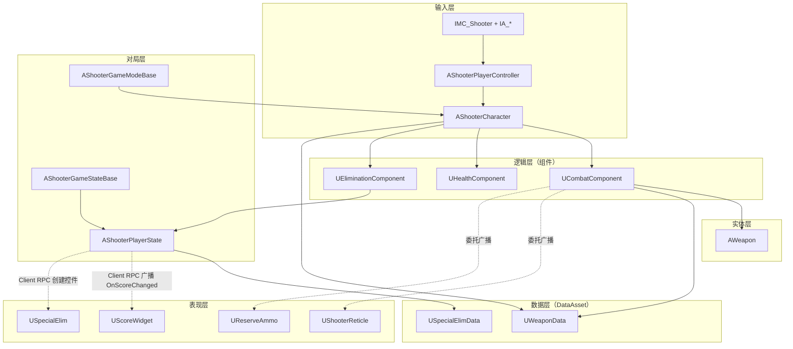
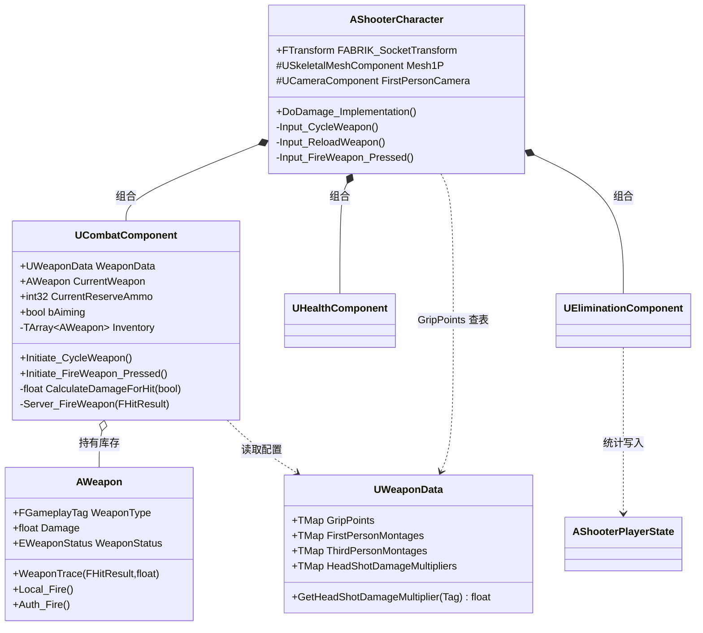
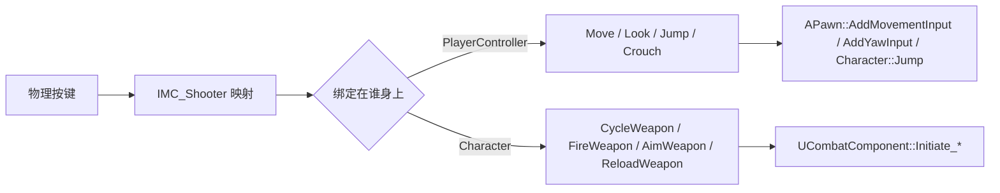
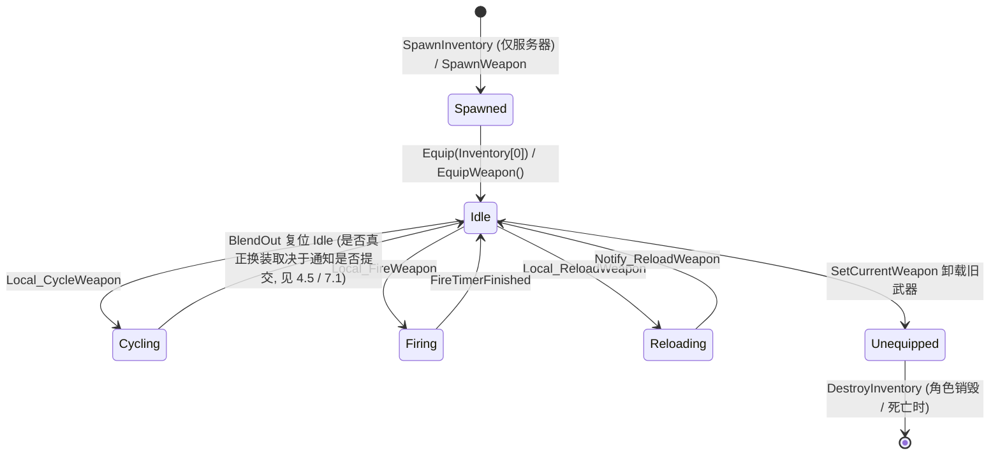
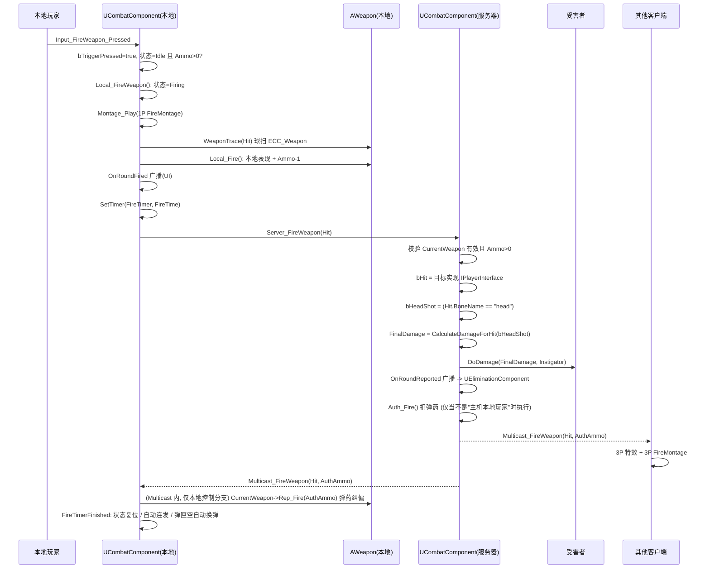
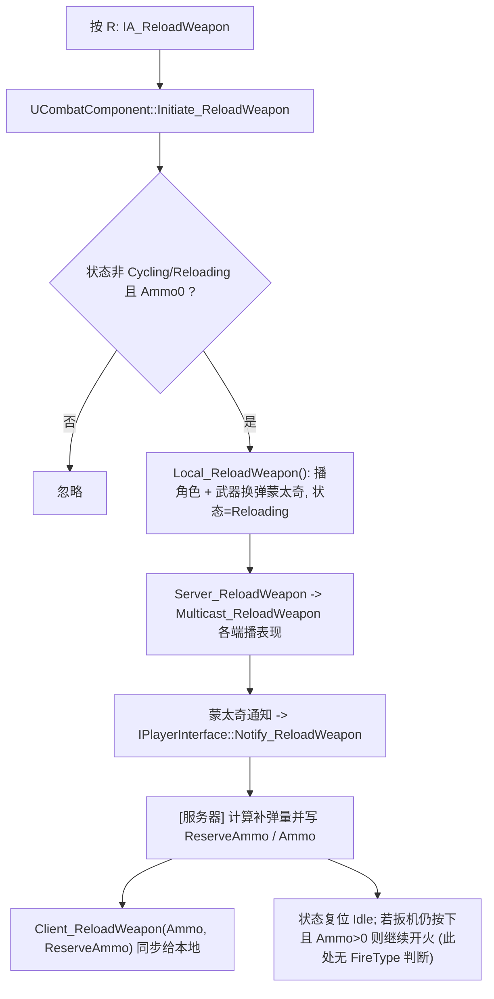
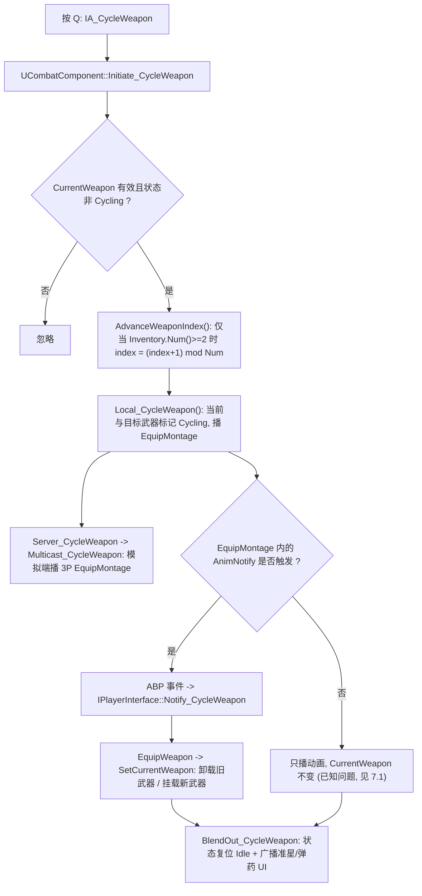
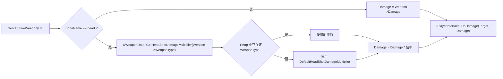
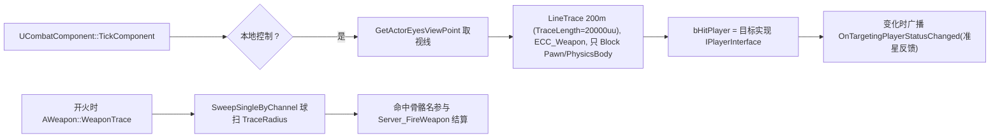
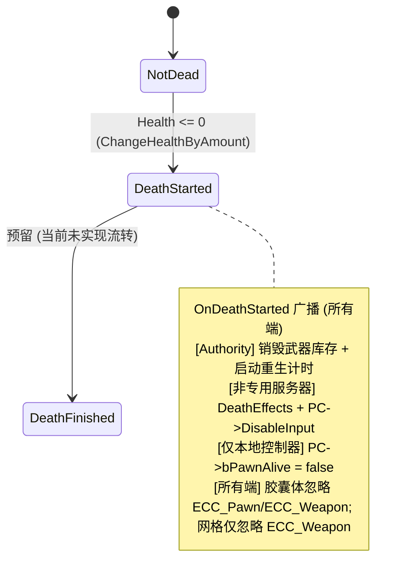

# FPS00 设计文档

| 项目 | 内容 |
|---|---|
| 项目名 | FPS00（模块名 `FPS`） |
| 引擎版本 | Unreal Engine 5.8 |
| 代码规模 | 38 个 `.h/.cpp` / 3449 行（统计口径：`Source/` 下全部 `.h` + `.cpp`，排除 `Intermediate/`） |
| 文档版本 | v1.0.3 |
| 最后更新 | 2026-09-15 |
| 文档范围 | 项目整体架构 + 战斗与武器系统（含伤害模型） |
| 绘图方式 | Mermaid（随代码一起维护，共 11 个图） |
| 仓库 | https://github.com/MoonRainMelody/FPS（仅代码，`Content/` 未入库） |

> 说明：本文档描述**当前代码**的实现，而不是目标设计。凡与代码不一致之处，以代码为准；发现偏差请直接更新本文档。

---

## 1. 项目概览

### 1.1 定位

第一人称射击（FPS）多人对战原型，核心特征：

- **服务器权威（Server Authoritative）** 的射击与伤害结算；
- **数据驱动**：附着点、角色动画蒙太奇/动画集、爆头倍率等**跨武器共享**的配置集中在数据资产 `UWeaponData`（按 `WeaponType` 索引）；而单把武器自身的参数（`Damage`、`MagCapacity`、`Ammo`、`FireType`、`FireTime`、`TraceRadius`、网格与图标）仍配置在武器蓝图 `AWeapon` 上；
- **组合优于继承**：角色能力全部以 `ActorComponent` 挂载（战斗 / 生命 / 淘汰），角色本身只做输入与状态桥接；
- **Enhanced Input** 输入系统 + GameplayTag 标识武器类型。

### 1.2 模块依赖

`Source/FPS/FPS.Build.cs`：

```text
PublicDependency : Core, CoreUObject, Engine, InputCore, GameplayTags,
                   PhysicsCore, UMG, Slate, SlateCore
PrivateDependency: EnhancedInput
```

### 1.3 目录结构

```text
Source/FPS/
├── FPS.Build.cs            # 模块构建规则
├── FPS.h / FPS.cpp         # 模块入口 + 自定义碰撞通道 FPSTraceChannels::ECC_Weapon
├── Public/                 # 头文件（按业务域分目录）
│   ├── Character/          # AShooterCharacter
│   ├── Combat/             # UCombatComponent
│   ├── Weapon/             # AWeapon
│   ├── Data/               # UWeaponData / USpecialElimData
│   ├── Health/             # UHealthComponent
│   ├── Elimination/        # UEliminationComponent
│   ├── Player/             # AShooterPlayerController / AShooterPlayerState
│   ├── Game/               # AShooterGameModeBase / AShooterGameStateBase
│   ├── Interfaces/         # IPlayerInterface
│   ├── Tags/               # ShooterTags（原生 GameplayTag）
│   ├── ShooterTypes/       # 公共枚举与结构体
│   └── UI/                 # 准星 / 备弹 / 计分 / 特殊击杀 Widget
└── Private/                # 对应实现
```

自定义碰撞通道：`FPSTraceChannels::ECC_Weapon = ECC_GameTraceChannel1`，用于武器射线，与角色胶囊（`ECC_Pawn`）分离。

---

## 2. 整体架构

### 2.1 分层视图



### 2.2 类职责

| 类 | 职责 | 关键点 |
|---|---|---|
| `AShooterCharacter` | 角色装配与输入转发；`IPlayerInterface` 实现 | 持有 Mesh1P/3P、相机、Combat/Health/Elimination；不直接实现战斗规则 |
| `AShooterPlayerController` | 输入映射（移动/视角/跳跃/蹲伏）、`bPawnAlive` 门控 | 蹲伏/跳跃绑定在 PC，武器相关绑定在 Character |
| `UCombatComponent` | 武器库存、开火/换弹/瞄准/切换、命中检测、伤害结算、UI 广播 | 战斗逻辑的唯一入口 |
| `AWeapon` | 武器实体：双端网格、弹药、开火表现、伤害基础值、附着 | 不处理输入，只被动响应 Combat |
| `UWeaponData` | 数据资产：附着点、动画蒙太奇、动画集、**爆头倍率** | 按 `WeaponType`（GameplayTag）索引 |
| `UHealthComponent` | 生命值、死亡状态机、变更事件 | `Health/MaxHealth` 仅复制给 Owner |
| `UEliminationComponent` | 击杀统计与特殊击杀判定（爆头/连杀/复仇/夺位…） | 仅在服务器绑定生效 |
| `AShooterPlayerState` | 对局统计与客户端播报队列 | `Client_*` RPC 驱动 HUD |
| `AShooterGameModeBase` | 死亡重生（随机 PlayerStart） | `RequestRespawn` |
| `AShooterGameStateBase` | 领先者判定、First Blood 标记 | 派生自 `PlayerArray` 计算 |
| `IPlayerInterface` | 角色能力契约（网格、附着点、通知、伤害、弹药） | 让 Combat/Weapon 不依赖具体角色类 |

### 2.3 组件关系



### 2.4 网络复制与 RPC 职责

| 归属 | 成员 | 复制方式 |
|---|---|---|
| `UCombatComponent` | `Inventory` | `DOREPLIFETIME` |
| `UCombatComponent` | `CurrentWeapon` | `ReplicatedUsing = OnRep_CurrentWeapon` |
| `UCombatComponent` | `bAiming` | `COND_SkipOwner` |
| `UCombatComponent` | `CurrentReserveAmmo` | `COND_OwnerOnly` |
| `UHealthComponent` | `DeathState` | `ReplicatedUsing = OnRep_DeathState` |
| `UHealthComponent` | `Health` / `MaxHealth` | `COND_OwnerOnly` |
| `AWeapon` | Actor 本身 | `bReplicates = true`，`bNetUseOwnerRelevancy = true` |
| `UEliminationComponent` | 无 | `SetIsReplicated(false)`：只在服务器运行，击杀统计不参与复制 |
| `AShooterPlayerState` | 统计字段（`ScoredElims` / `Defeats` / `Hits` / `Misses` / `HeadShotElims` / `Streak` 等） | **均未加复制标记**：客户端只能通过 `Client_ScoredElim` / `Client_SpecialElim` / `Client_LostTheLead` 获得展示数据 |
| `AShooterPlayerController` | Actor 本身 | 构造函数 `bReplicates = true` |
| `AShooterCharacter` 的组件 | `Combat` / `Health` / `Elimination` | 构造函数 `SetIsReplicated(true)` / `SetIsReplicated(true)` / `SetIsReplicated(false)`；`UHealthComponent` 另在自身构造函数 `SetIsReplicatedByDefault(true)` |

RPC 一览：

| RPC | 方向 | 用途 |
|---|---|---|
| `Server_FireWeapon` | Client → Server | 上报命中结果，服务器结算伤害 |
| `Multicast_FireWeapon` | Server → All | 表现同步（3P 特效/蒙太奇）、本地弹药纠偏 |
| `Server_ReloadWeapon` / `Multicast_ReloadWeapon` | C→S / S→All | 换弹表现与状态 |
| `Client_ReloadWeapon` | Server → Owner | 同步权威弹药数 |
| `Server_Aim` | Client → Server | 瞄准状态 |
| `Server_CycleWeapon` / `Multicast_CycleWeapon` | C→S / S→All | 切换武器，模拟端播 3P 切换动画 |
| `Server_EquipWeapon` | Client → Server | 提交装备请求 |
| `Multicast_HitReact` | Server → All | 受击蒙太奇 |
| `Client_ScoredElim` / `Client_SpecialElim` / `Client_LostTheLead` | Server → Owner | 击杀播报与失位提示 |

**设计约定**：伤害、弹药、击杀统计一律在**服务器**结算；客户端只做表现与本地预测（弹药临时扣减、特效、蒙太奇）。

### 2.5 输入链路



- IMC 在 `AShooterPlayerController::BeginPlay` 中通过 `UEnhancedInputLocalPlayerSubsystem::AddMappingContext(ShooterIMC, 0)` 添加。
- 武器相关输入绑定在 `AShooterCharacter::SetupPlayerInputComponent`；移动类输入绑定在 `AShooterPlayerController::SetupInputComponent`。
- 蹲伏当前实现：`Started` 事件翻转 `CharacterMovement->bWantsToCrouch`。

完整绑定表（`InputAction` 资产位于 `Content/FPS/Input/InputAction/`）：

| 绑定类 | InputAction | 事件类型 | 处理函数 |
|---|---|---|---|
| `AShooterPlayerController` | `IA_Move` | `Triggered` | `Input_Move`（`AddMovementInput`，受 `bPawnAlive` 门控） |
| `AShooterPlayerController` | `IA_Look` | `Triggered` | `Input_Look`（`AddYawInput` / `AddPitchInput`，受门控） |
| `AShooterPlayerController` | `IA_Jump` | `Started` | `Input_Jump`：若 `bWantsToCrouch` 为真则先取消蹲伏，否则 `Character->Jump()` |
| `AShooterPlayerController` | `IA_Crouch` | `Started` | `Input_Crouch`：翻转 `bWantsToCrouch`（受门控） |
| `AShooterCharacter` | `IA_CycleWeapon` | `Started` | `Input_CycleWeapon` |
| `AShooterCharacter` | `IA_FireWeapon` | `Started` / `Completed` | `Input_FireWeapon_Pressed` / `Input_FireWeapon_Released` |
| `AShooterCharacter` | `IA_AimWeapon` | `Started` / `Completed` | `Input_Aim_Pressed` / `Input_Aim_Released`（同时触发 `OnAim` 蓝图事件） |
| `AShooterCharacter` | `IA_ReloadWeapon` | `Started` | `Input_ReloadWeapon` |

> 资产约定说明：`IMC_Shooter`、`IA_*` 是资产名（`Content/FPS/Input/`）。代码中只持有 `TObjectPtr<UInputMappingContext>` / `TObjectPtr<UInputAction>`，具体资产在 `BP_ShooterPlayerController`（`ShooterIMC` / `MoveAction` / `LookAction` / `JumpAction` / `CrouchAction`）与 `BP_ShooterCharacter`（`CycleWeaponAction` / `FireWeaponAction` / `AimWeaponAction` / `ReloadWeaponAction`）上指定，**无法从 C++ 验证绑定关系**。

---

## 3. 对局流程

### 3.1 死亡与重生

```mermaid
sequenceDiagram
    participant Atk as 攻击者(Server)
    participant Vic as 受害者 AShooterCharacter
    participant HC as UHealthComponent
    participant GM as AShooterGameModeBase
    participant PC as AShooterPlayerController

    Atk->>HC: DoDamage(FinalDamage)
    HC->>HC: ChangeHealthByAmount(-Damage) 并 Clamp(0, MaxHealth)
    HC->>HC: Health <= 0 -> StartDeath()
    HC->>Vic: OnDeathStarted 广播
    Vic->>Vic: [服务器] DestroyInventory() + 启动 RespawnTime 计时
    Vic->>Vic: [非专用服务器] DeathEffects() + PC->DisableInput()
    Vic->>Vic: [仅本地控制器] PC->bPawnAlive=false
    Vic->>Vic: 胶囊体忽略 ECC_Pawn 与 ECC_Weapon; 网格仅忽略 ECC_Weapon
    Vic->>GM: DeathTimerFinished -> RequestRespawn(Character, Controller)
    GM->>GM: Character->Reset() + Destroy()
    GM->>GM: 随机 PlayerStart -> RestartPlayerAtPlayerStart
    GM->>Vic: 新角色 PossessedBy -> SpawnInventory() + Equip(Inventory[0])
```

要点：

- `EDeathState` 定义了 `NotDead / DeathStarted / DeathFinished`，**当前实现只使用前两者**，`DeathFinished` 为后续扩展预留。
- 重生期间 `bPawnAlive = false` 会门控移动类输入；武器输入未做该门控（死亡时通过 `DisableInput` 整体关闭）。
- `Health/MaxHealth` 用 `COND_OwnerOnly` 复制，因此**代码上只有本人能读到自己的血量**（其他端拿不到；这样设计的原因未在代码中说明）。

### 3.2 领先者与 First Blood

每次击杀后，由 `UEliminationComponent::UpdateLeaderStatus` 执行领先权判定：

1. 记录击杀前的唯一领先者 `LastLeader = GameState->GetSoleLeader()`，以及"攻击者此前是否并列领先"；
2. 调用 `AShooterGameStateBase::UpdateLeader()`：按 `GetScoredElims()` 降序排序 `PlayerArray`，把并列最高分集合写入 `Leaders`，**并在函数末尾把 `bHasFirstBloodBeenHad` 置为 `true`**；
3. 依据前后变化设置位掩码：攻击者从"非并列"变为"并列"→ `TiedTheLeader`；领先者易主 → 给 `LastLeader` 发 `Client_LostTheLead`，且若**受害者正是那位失去领先权的 `LastLeader`** → `Dethrone`（并 `AddDethroneElim()`）；攻击者成为唯一领先者 → `GainedTheLead`。

> **顺序敏感**：`FirstBlood` 的判定发生在 `UpdateLeader()` **之前**（`ProcessElimination` 里先 `HandleFirstBlood`、后 `UpdateLeaderStatus`），因为 `UpdateLeader()` 会无条件把 `bHasFirstBloodBeenHad` 置 true——调换顺序会导致 FirstBlood 永远拿不到。

---

## 4. 战斗与武器系统

### 4.1 武器生命周期



> 注：图中的 `Spawned` 是生命周期阶段（`AWeapon` 刚生成、尚未装备），`EWeaponStatus` 枚举里**没有** `Spawned` 这个值——生成时武器状态就是构造函数里的 `Idle`。

`EWeaponStatus`（定义于 `Weapon.h`）的取值为 `Idle / Firing / Reloading / Cycling / Unequipped`。三个入口的**实际**守卫条件如下——注意它们**并非完全互斥**，`Weapon.h` 中 "`Firing`: can't reload/cycle" 的注释只是设计意图，实现并未强制：

| 入口 | 实际守卫（代码） |
|---|---|
| `Initiate_FireWeapon_Pressed` | 先无条件置 `bTriggerPressed = true`；仅当 `WeaponStatus == Idle && Ammo > 0` 才真正开火 |
| `Initiate_ReloadWeapon` | 排除 `Cycling` / `Reloading`，**不排除 `Firing`**；另需 `Ammo != MagCapacity` 且 `CurrentReserveAmmo != 0` |
| `Initiate_CycleWeapon` | 仅排除 `Cycling`，**不排除 `Firing` / `Reloading`** |

> 因此状态互斥是**不完整**的：在 `Firing` 状态下按 R 或 Q 会照常进入换弹/切换流程并覆盖武器状态。改动状态相关逻辑时请以上表为准，不要依赖枚举注释。

### 4.2 开火流程（含伤害结算）



自动武器连发：`FireTimerFinished` 中若 `bTriggerPressed` 且 `FireType == Auto` 且 `Ammo > 0`，则再次进入 `Local_FireWeapon()`，射速由 `AWeapon::FireTime` 决定。

### 4.3 弹药纠偏模型

客户端为保持手感做本地预测，服务器为权威。设服务器权威弹药为 $A_{\text{auth}}$，本地已开火但未被确认的次数为 $S_{\text{pending}}$，则客户端显示弹药为：

$$A_{\text{display}} = A_{\text{auth}} - S_{\text{pending}}$$

对应实现 `AWeapon::Rep_Fire(int32 AuthAmmo)`：接收权威值后 `--Sequence`，再减去剩余 `Sequence`。

### 4.4 换弹流程



补弹量：

$$\Delta A = \min\left(M_{\text{cap}} - A_{\text{mag}},\ A_{\text{reserve}}\right)$$

另有一条自动换弹路径：`FireTimerFinished` 检测到弹匣为 0 且备弹 > 0 时，本地直接触发换弹。

### 4.5 武器切换流程



**关键设计约束**：`Notify_CycleWeapon()` 在 C++ 中**没有自动调用点**，切换的"提交"必须由 `EquipMontage` 里的动画通知驱动（通知 → 动画蓝图事件 → 角色接口 → `Combat::Notify_CycleWeapon` → `EquipWeapon`）。这是当前架构最脆弱的一环，详见 7.1。

### 4.6 伤害模型（爆头倍率）

伤害在**服务器**唯一结算，入口 `UCombatComponent::Server_FireWeapon_Implementation`：

```cpp
const bool bHeadShot = Hit.BoneName == "head";
bLethal = IPlayerInterface::Execute_DoDamage(Hit.GetActor(), CalculateDamageForHit(bHeadShot), GetOwner());
```

最终伤害：

$$
D_{\text{final}} =
\begin{cases}
D_{\text{base}} \cdot M_{\text{head}}(T_{\text{weapon}}), & \text{命中骨骼为 } \texttt{head} \\
D_{\text{base}}, & \text{其他情况}
\end{cases}
$$

其中：

- $D_{\text{base}}$ = `AWeapon::Damage`（每把武器的基础伤害）；
- $T_{\text{weapon}}$ = `AWeapon::WeaponType`（GameplayTag，如 `Weapon.Type.Pistol`）；
- $M_{\text{head}}(T)$ = `UWeaponData::GetHeadShotDamageMultiplier(T)`：

$$
M_{\text{head}}(T) =
\begin{cases}
\texttt{HeadShotDamageMultipliers}[T], & T \text{ 已配置} \\
\texttt{DefaultHeadShotDamageMultiplier}, & T \text{ 未配置}
\end{cases}
$$

设计要点：

1. **数据与逻辑分离**：倍率数据挂在数据资产 `UWeaponData` 上，查询封装在数据对象自身（`BlueprintPure`，可被 UI/命中反馈复用）；伤害修正集中在 `UCombatComponent::CalculateDamageForHit` 一个函数内，未来增加距离衰减、护甲穿透等修正只需改这一处。
2. **安全回退**：漏配某个 `WeaponType` 不会导致 0 伤害，而是回退 `DefaultHeadShotDamageMultiplier`（默认 `1.0`，即不放大，等价于改动前行为）。
3. **权威一致**：倍率只在服务端应用；击杀播报使用的 `bHeadShot` 与伤害使用同一判定，保证"伤害数值"与"爆头击杀提示"不矛盾。
4. **可测试**：`CalculateDamageForHit` 为 `const` 纯查询函数，便于单元测试。

补充：`IPlayerInterface::DoDamage` 的返回值约定是"是否致死"。`AShooterCharacter::DoDamage_Implementation` 先扣血，**致死时直接返回 `true`**（不播受击动画）；**非致命时**随机取一个 `HitReacts` 蒙太奇并通过 `Multicast_HitReact` 在所有端播放，返回 `false`。该布尔值沿 RPC 返回服务器后即为 `bLethal`，再驱动淘汰统计与播报。



#### 配置示例（DA_WeaponData）

| 分类 | 字段 | 说明 |
|---|---|---|
| `FPS\|WeaponData\|Damage` | `HeadShotDamageMultipliers` | Key = `Weapon.Type.Pistol` / `Weapon.Type.Rifle`，Value = 倍率 |
| `FPS\|WeaponData\|Damage` | `DefaultHeadShotDamageMultiplier` | 未单独配置的武器类型使用；`1.0` 表示不放大 |

### 4.7 数据资产 `UWeaponData` 字段总览

| 字段 | 类型 | 用途 |
|---|---|---|
| `GripPoints` | `TMap<FGameplayTag, FName>` | 武器类型 → 角色骨骼附着点 |
| `WeaponMontages` | `TMap<FGameplayTag, FMontageData>` | 武器自身蒙太奇（如 `AM_MM_*`） |
| `FirstPersonAnims` / `ThirdPersonAnims` | `TMap<FGameplayTag, FPlayerAnims>` | 待机/瞄准/蹲姿/冲刺/瞄准偏移/位移混合空间 |
| `FirstPersonMontages` / `ThirdPersonMontages` | `TMap<FGameplayTag, FMontageData>` | 角色蒙太奇（装备/换弹/开火） |
| `HeadShotDamageMultipliers` | `TMap<FGameplayTag, float>` | **本次新增**：武器类型 → 爆头倍率 |
| `DefaultHeadShotDamageMultiplier` | `float` | **本次新增**：未配置时的回退倍率 |

`FMontageData` 结构：`EquipMontage / ReloadMontage / FireMontage`。

字段的实际使用点（按 C++ 引用逐条核对，避免误以为全部由代码消费）：

| 字段 | C++ 中的使用点 |
|---|---|
| `GripPoints` | `AShooterCharacter::GetWeaponAttachPoint_Implementation` |
| `FirstPersonMontages` | 换枪 `Local_CycleWeapon`、开火 `Local_FireWeapon`、换弹 `Local_ReloadWeapon` |
| `ThirdPersonMontages` | 换枪 `Local_CycleWeapon`（非本地分支）、开火 `Multicast_FireWeapon`（非本地分支）、换弹 `Local_ReloadWeapon`（非本地分支） |
| `WeaponMontages` | **仅**换弹 `Local_ReloadWeapon`（取 `ReloadMontage`）；武器自身的开火蒙太奇在 C++ 中未被使用 |
| `FirstPersonAnims` / `ThirdPersonAnims` | **C++ 中无任何引用**，供动画蓝图自行读取（属资产侧约定） |

关键默认值（均来自各构造函数，改动数值时以代码为准）：

| 对象 | 参数 | 默认值 | 来源 |
|---|---|---|---|
| `AWeapon` | `Damage` / `MagCapacity` / `Ammo` / `StartingCarriedAmmo` | `15` / `10` / `5` / `10` | `Weapon.cpp` |
| `AWeapon` | `FireTime` / `TraceRadius` / `AimFieldOfView` | `0.1` / `5` / `65` | `Weapon.cpp` |
| `UCombatComponent` | `TraceLength` | `20000`（uu，即 200m） | `CombatComponent.cpp` |
| `UHealthComponent` | `Health` / `MaxHealth` | `100` / `100` | `HealthComponent.cpp` |
| `AShooterCharacter` | `RespawnTime` / `DefaultFieldOfView` | `3` / `90` | `ShooterCharacter.cpp` |
| `UEliminationComponent` | `SequentialElimInterval` / `ElimsNeededForStreak` | `2` / `5` | `EliminationComponent.cpp` |
| `AShooterPlayerState` | `ElimDisplayTime` | `0.5` | `ShooterPlayerState.cpp` |

### 4.8 命中检测



- 准星"锁定敌人"检测每帧执行（仅本地）；
- 开火命中使用球形扫描（半径 `AWeapon::TraceRadius`）而非细线，命中点用于特效与伤害结算。

---

## 5. 动画与输入约定

### 5.1 动画蓝图分工

| 资产 | 挂载对象 | 职责 |
|---|---|---|
| `ABP_FirstPerson` | `AShooterCharacter::Mesh1P` | 本地手臂动画、武器蒙太奇（1P） |
| `ABP_ThirdPerson` | `AShooterCharacter::GetMesh()` | 其他玩家看到的身体、蹲伏/站立混合、位移混合空间 |

角色蒙太奇一律经 `UWeaponData` 按 `WeaponType` 查表后 `Montage_Play`，**代码中不出现硬编码动画引用**。

> 说明：上表的 AnimClass 绑定由 `BP_ShooterCharacter` 的 Mesh 组件在编辑器里配置，C++ 侧只创建组件、不设置 `AnimClass`（因此"哪个蓝图挂在哪个 Mesh"属资产约定，代码中无法验证）。

### 5.2 蒙太奇通知约定（重要）

| 通知名 | 触发方 | 期望的动画蓝图事件 | 作用 |
|---|---|---|---|
| `CycleWeapons` | 1P `FP_AM_*_Equip`（已确认存在）；3P / 武器蒙太奇内的通知情况未验证，以资产为准 | `AnimNotify_CycleWeapons` | 调 `IPlayerInterface::Notify_CycleWeapon` 提交换枪 |
| （换弹通知） | `*_Reload` 蒙太奇 | 对应通知事件（名称以动画资产为准） | 调 `IPlayerInterface::Notify_ReloadWeapon` 结算补弹 |

**必须在动画蓝图 Event Graph 中实现同名事件**，否则蒙太奇会正常播放但游戏逻辑不会执行（详见 7.1）。

> 资产约定说明：通知名（如 `CycleWeapons`）与动画蓝图事件名（`AnimNotify_*`）只存在于动画资产中。C++ 侧对应的接口是**单数**的 `Notify_CycleWeapon` / `Notify_ReloadWeapon`（`PlayerInterface.h`），且 `Execute_Notify_*` 在工程内 **0 命中**，因此"通知名 ↔ 事件名 ↔ 接口名"的对应关系**无法从 C++ 验证**，必须以动画资产为准。

### 5.3 蹲伏与位移

- 蹲伏前置：`GetCharacterMovement()->MovementState.bCanCrouch = true`（UE 5.5+ 的 `FMovementState`）。
- 动画侧读取 `CharacterMovement->IsCrouching()`（即引擎的 `bIsCrouched`）作为站立/蹲姿状态机导管条件——**这是动画蓝图里的用法：C++ 工程内 `IsCrouching` 零引用**（grep 0 命中），属资产约定；C++ 侧只负责把 `MovementState.bCanCrouch` 置为 `true` 并翻转 `bWantsToCrouch`。
- 转向/位移参数由 `AShooterCharacter::CalculateTurnInPlaceParameters` / `TurnInPlace` 计算：`AO_Yaw`、`MovementOffsetYaw`、`TurningStatus`。
- 本地手臂 FABRIK：`CalculateFABRIKSocketTransform` 每帧取 3P 武器的 `FABRIK_Socket` 世界变换，再用 `GetMesh()->TransformToBoneSpace("hand_r", ...)` 转到角色**右手骨骼**空间并写入 `FABRIK_SocketTransform`（供动画蓝图 IK 使用）。

---

## 6. 生命与淘汰系统

### 6.1 生命状态机



`UHealthComponent` 的数值变更入口只有 `ChangeHealthByAmount` / `ChangeMaxHealthByAmount`（另有 `GetHealthNormalized`、`FindHealthComponent` 等只读/查询接口），所有变更都会广播 `OnHealthChanged`，UI 无需轮询。

### 6.2 特殊击杀判定

`UEliminationComponent::OnRoundReported` 由 `Combat::OnRoundReported` 驱动（仅在服务器绑定），判定位掩码 `ESpecialElimType`：

| 类型 | 触发条件 |
|---|---|
| `Headshot` | 命中骨骼为 `head` 且致死 |
| `Sequential` | 两次击杀间隔 ≤ `SequentialElimInterval`（默认 2s） |
| `Streak` | 连续击杀 ≥ `ElimsNeededForStreak`（默认 5） |
| `Revenge` | 击杀上一个击杀自己的玩家 |
| `Dethrone` | 击杀"本次击杀前的唯一领先者"，并因此造成领先权易主 |
| `Showstopper` | 击杀处于连杀状态的玩家 |
| `FirstBlood` | 全局第一次击杀 |
| `GainedTheLead` / `TiedTheLeader` / `LostTheLead` | 领先状态变化 |

结果通过 `AShooterPlayerState::Client_SpecialElim` / `Client_ScoredElim` 下发到本地：

- `Client_ScoredElim` 只广播 `OnScoreChanged`（`UScoreWidget` 订阅它刷新比分）；
- `Client_SpecialElim` 把位掩码用 `DecodeElimBitmask` 拆成多个类型，逐个查 `USpecialElimData::SpecialElimInfo` 取文案与图标，再入 **FIFO 队列** `SpecialElimQueue`，由 `ProcessNextSpecialElim` 按 `ElimDisplayTime`（默认 0.5s）间隔依次弹出 `USpecialElim` 控件；
- `Sequential` / `Streak` 的显示文案在 `ShowSpecialElim` 内按次数**覆盖**为 `Double/Triple/Quad Elim!`、`Rampage xN!`、`Streak xN!`（不依赖数据资产文案）；
- `LostTheLead` 走独立的 `Client_LostTheLead`，直接创建一个 `USpecialElim` 控件。

另注：`Dethrone` 的判定要求"受害者正是失去领先权的那一位"（`VictimPS == LastLeader` 且领先者已易主），并非任意击杀领先者都算。

---

## 7. 已知问题与注意事项

### 7.1 武器切换依赖动画通知（高风险）

- **现象**：按 Q 时蒙太奇正确播放（Pistol/Rifle 交替），但手上武器不变。
- **原因**：提交切换的入口是 `UCombatComponent::Notify_CycleWeapon()`，它在 C++ 中只被 `AShooterCharacter::Notify_CycleWeapon_Implementation()`（`IPlayerInterface` 的实现）调用；而**这个接口方法在整个 C++ 工程里没有任何调用点**（`Execute_Notify_CycleWeapon` 全工程 0 命中），设计上必须由 `EquipMontage` 内的 `CycleWeapons` 通知、经动画蓝图事件去调用它。缺了这一环，`Notify_CycleWeapon → EquipWeapon → SetCurrentWeapon` 永不执行，表现就是"动画正常播放、武器不变"。
- **排查手段**：在 `Initiate_CycleWeapon` / `Local_CycleWeapon` / `Notify_CycleWeapon` / `BlendOut_CycleWeapon` / `EquipWeapon` 各节点加日志，可迅速定位断点；监听 `UAnimInstance::OnPlayMontageNotifyBegin` 可判断通知是否真正触发。
- **修复方向**：
  1. 在 `ABP_FirstPerson` 的 Event Graph 实现 `AnimNotify_CycleWeapons` → `Cast to AShooterCharacter` → `Notify_CycleWeapon`（最贴近原设计）；
  2. 或在 `BlendOut_CycleWeapon` 增加"未提交则补提交"的代码兜底（切换点会退化为动画播完）；
  3. 或实现 C++ `UAnimNotify` 子类替换蒙太奇中的通知（最可控，需改资产）。

### 7.2 PIE 中 Shift 被引擎占用

UE 5.8 引擎 `BaseInput.ini` 的 `DebugExecBindings` 将 `LeftShift/RightShift` 绑定到 `DebugManager.CycleToPrevious/NextColumn`。若计划用 Shift 做冲刺，需在项目 `Config/DefaultInput.ini` 中用 `-DebugExecBindings=(...)` 移除。

### 7.3 蹲伏的引擎前置条件（按引擎源码改写）

"按了蹲伏键但蹲不下去"时，真实的条件链如下（依据 UE 5.8 引擎源码，而非记忆）：

1. 项目侧：`AShooterCharacter` 构造函数里 `GetCharacterMovement()->MovementState.bCanCrouch = true`（`ShooterCharacter.cpp`）。
2. `ACharacter::Crouch()` 只在 `ACharacter::CanCrouch()` 为真时才把 `CharacterMovement->bWantsToCrouch = true`；
   `ACharacter::CanCrouch()` = `!IsCrouched() && CharacterMovement && CanEverCrouch() && GetRootComponent() && !GetRootComponent()->IsSimulatingPhysics()`。
3. `CanEverCrouch()` 定义在 `NavMovementInterface.h`：`return GetNavAgentPropertiesRef().bCanCrouch;` ——**第 1 步的 `MovementState.bCanCrouch` 就是这里读的那一位**，没置 true 则第 2 步直接静默返回（非 Shipping 下会打一条 `LogCharacter` 日志）。
4. `UCharacterMovementComponent::Crouch()` 还会再判一次 `CanCrouchInCurrentState()`，UE 5.8 的实现是：
   `return (IsFalling() || IsMovingOnGround()) && UpdatedComponent && !UpdatedComponent->IsSimulatingPhysics();`
   即**可以在下落中蹲**，但不能在游泳/飞行等状态蹲。
5. 最后是胶囊尺寸与穿插检查：若胶囊已是蹲姿高度则直接 `SetIsCrouched(true)` 返回；否则用 `OverlapBlockingTestByChannel` 做阻挡测试，**若被场景挡住（encroached）则取消本次蹲伏**。

> 更正记录：本节此前写作 "`IsMovingOnGround() || bCanCrouchInAir`"——`bCanCrouchInAir` 这个成员在 UE 5.8 的 Engine 运行时中**并不存在**（全量搜索 0 命中），属早期教程/旧版本写法，已按源码更正。
>
> 依据：`Engine/Source/Runtime/Engine/Private/Character.cpp`（`ACharacter::CanCrouch` / `Crouch`）、`Engine/Source/Runtime/Engine/Private/Components/CharacterMovementComponent.cpp`（`CanCrouchInCurrentState` / `Crouch`）、`Engine/Source/Runtime/Engine/Classes/Interfaces/NavMovementInterface.h`（`CanEverCrouch`）。

### 7.4 其他

- `bPawnAlive` 只门控移动/视角/跳跃/蹲伏输入，武器输入依赖 `DisableInput`；
- `WeaponData` 的 `FindChecked` 调用在缺失 `WeaponType` 配置时会崩溃：蒙太奇查表（`FirstPersonMontages` / `ThirdPersonMontages` / `WeaponMontages`）以及 `ReserveAmmo.FindChecked`（`Equip` / `SetCurrentWeapon` / `Notify_ReloadWeapon` / `AddAmmo`）；新增武器类型时必须补齐所有映射；
- 伤害与命中由客户端上报 `FHitResult`（服务器未做二次校验），属原型阶段的信任模型，正式化需服务端重放校验。

---

## 8. 扩展指南

### 8.1 新增一把武器

1. 新建蓝图（继承 `AWeapon`，参考 `BP_Pistol` / `BP_Rifle`），设置 `WeaponType`、`Damage`、`MagCapacity`、`Ammo`、`FireType`、`FireTime`、网格与图标；
2. 在 `DA_WeaponData` 中补齐该 `WeaponType` 的：`GripPoints`、`WeaponMontages`、`FirstPersonMontages`、`ThirdPersonMontages`、`FirstPersonAnims`、`ThirdPersonAnims`、`HeadShotDamageMultipliers`；
3. 把武器蓝图类加入 `BP_ShooterCharacter` 的 `CombatComponent::DefaultWeaponClasses`；
4. 确保 `EquipMontage` 内含 `CycleWeapons` 通知且动画蓝图已实现对应事件（见 7.1）。

### 8.2 新增武器类型

在 `ShooterTags` 中新增原生标签（如 `TAG_WeaponType_Shotgun = "Weapon.Type.Shotgun"`），随后按 8.1 配置数据。

### 8.3 扩展伤害模型（建议）

当前爆头判定硬编码骨骼名 `"head"`。若需支持多部位（`neck`、四肢倍率差异）或不同骨架，建议：

- 把部位规则提升为数据：在 `UWeaponData` 中增加 `TMap<FName, float> HitZoneDamageMultipliers`（骨骼名 → 倍率），
- `CalculateDamageForHit` 改为接收 `FHitResult` 并按骨骼查倍率，未命中配置回退 `1.0`；
- 这样可同时覆盖爆头、爆头倍率、减伤部位，且无需改动调用方。

---

## 9. 变更记录

| 版本 | 日期 | 变更内容 |
|---|---|---|
| v1.0 | 2026-09-10 | 初版：整体架构、网络职责、对局流程、战斗与武器系统（开火/换弹/切换/命中）、生命与淘汰系统、已知问题与扩展指南；伤害模型纳入爆头倍率（`UWeaponData::HeadShotDamageMultipliers` + `UCombatComponent::CalculateDamageForHit`） |
| v1.0.1 | 2026-09-10 | 逐条回代码核对并修正 22 处：修正"伤害参数归属""FABRIK 骨骼名""AdvanceWeaponIndex 条件""Auth_Fire 执行条件""死亡分支所在端""类图访问级别"等不准确表述；补充完整输入绑定表、`UWeaponData` 各字段的实际使用点、`PlayerState` 统计不复制与播报队列细节、`DoDamage` 返回值语义；对无法从代码验证的资产约定（AnimClass、3P 通知、引擎 crouch 实现）加注来源说明 |
| v1.0.2 | 2026-09-10 | 依据一次**独立交叉核对**（对全部 38 个源文件做了一次通读）再修 18 处，重点纠正：`AWeapon → UWeaponData` 依赖边（实为 Character 经接口查表 `GripPoints`）、换弹后"继续开火"条件（无 `FireType` 判断）、武器状态机图状态名（`Equipped`→`Idle`）与**"三入口互斥"断言**（实际守卫不完整：reload/cycle 都不排除 `Firing`，枚举注释与实现不符）、领先权判定归属（实为 `UEliminationComponent::UpdateLeaderStatus`）、碰撞忽略范围（网格仅忽略 `ECC_Weapon`）、`Rep_Fire` 调用主体（`AWeapon` 方法、在 Multicast 内调用）、通知缺口措辞（缺的是接口入口调用方而非 C++ 调用点）；新增复制清单（PC 与组件 `SetIsReplicated`）、关键默认值表、`UpdateLeader` 与 FirstBlood 的顺序敏感性，并把 7 项资产/引擎约定统一加注 |
| v1.0.3 | 2026-09-15 | 第三次按代码复核（脚本化抽取文档中全部 335 个反引号符号 + 引擎级声称逐条回查）：① **更正 7.3 的引擎前置条件**——原文写的 `bCanCrouchInAir` 在 UE 5.8 Engine 运行时中并不存在（全量搜索 0 命中），已按 `ACharacter::CanCrouch` / `CanEverCrouch`（`NavMovementInterface.h`）/ `UCharacterMovementComponent::Crouch` 与 `OverlapBlockingTestByChannel` 的真实链条重写；② 更正 v1.0.2 条目里的源文件数（36 → **38**）；③ 核实并保留以下结论——引擎 `BaseInput.ini` 第 51–52 行确实把 Shift 绑定到 `DebugManager.CycleToNext/PreviousColumn`（7.2 成立）、`CharacterMovementComponent::CanCrouchInCurrentState()` 确实存在、`AShooterPlayerState::ShowSpecialElim` 中 `Double/Triple/Quad Elim!` 与 `Rampage x%d!` / `Streak x%d!` 文案覆盖确实存在于 C++（6.2 成立）、`Content/FPS/Input/InputAction/` 下 8 个 `IA_*` 资产与 2.5 绑定表逐名一致、`FP_AM_*_Equip` 资产命名成立；④ 核对 4.1 状态机与守卫表、6.1 生命状态机、7.1 通知缺口三处与代码一致；⑤ 文档头补充代码规模、图数与仓库链接 |
